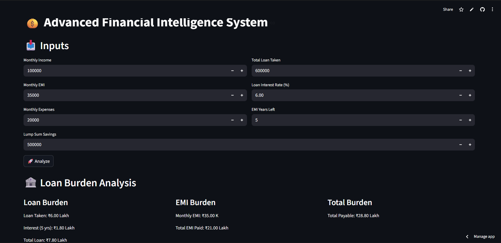

# 💰 Smart Financial Decision System

A Streamlit-based financial advisor application that analyzes income, expenses, EMI, and savings to evaluate financial health and guide users toward smarter financial decisions.

---

## 🚀 Live App
👉 https://financial-intelligence-system-4utkjsrhlf5ceunmaa2rmh.streamlit.app  

---

## 📸 Screenshots

### 📊 Dashboard

### 🏦 Loan & EMI Analysis

### 📈 SIP Calculator

---

## 🧠 Key Features

✔ Income, Expense & EMI Analysis  
✔ Loan Burden Calculation (Principal + Interest)  
✔ EMI Impact Visualization  
✔ Financial Health Detection (Savings & Cashflow)  
✔ Emergency Fund Calculation (6 months EMI)  
✔ Lump Sum Investment Strategy  
✔ FD vs SIP Comparison  
✔ Interactive SIP Calculator (Slider-based)  
✔ Predefined SIP Plans (₹5K / ₹10K / ₹20K)  
✔ Real-time Financial Feedback & Warnings  

---

## ⚙️ Tech Stack

- Python  
- Streamlit  
- Financial Calculations  
- Basic Data Modeling  

---

## 💡 How It Works

- User inputs:
  - Monthly Income  
  - Monthly EMI  
  - Monthly Expenses  
  - Loan Details  
  - Lump Sum Savings  

- System calculates:
  - Monthly Savings & Cashflow  
  - Total Loan Burden (with interest)  
  - Total EMI paid over time  
  - Emergency fund requirement  

- Provides:
  - Investment suggestions (FD & SIP)  
  - SIP growth projections  
  - Financial warnings & insights  

---

## 📊 Financial Logic Implemented

- Simple Interest for Loan Burden  
- Compound Growth for SIP  
- Monthly Cashflow Analysis  
- Emergency Fund Planning  
- Investment Return Estimation  

---

## 📂 Project Structure
